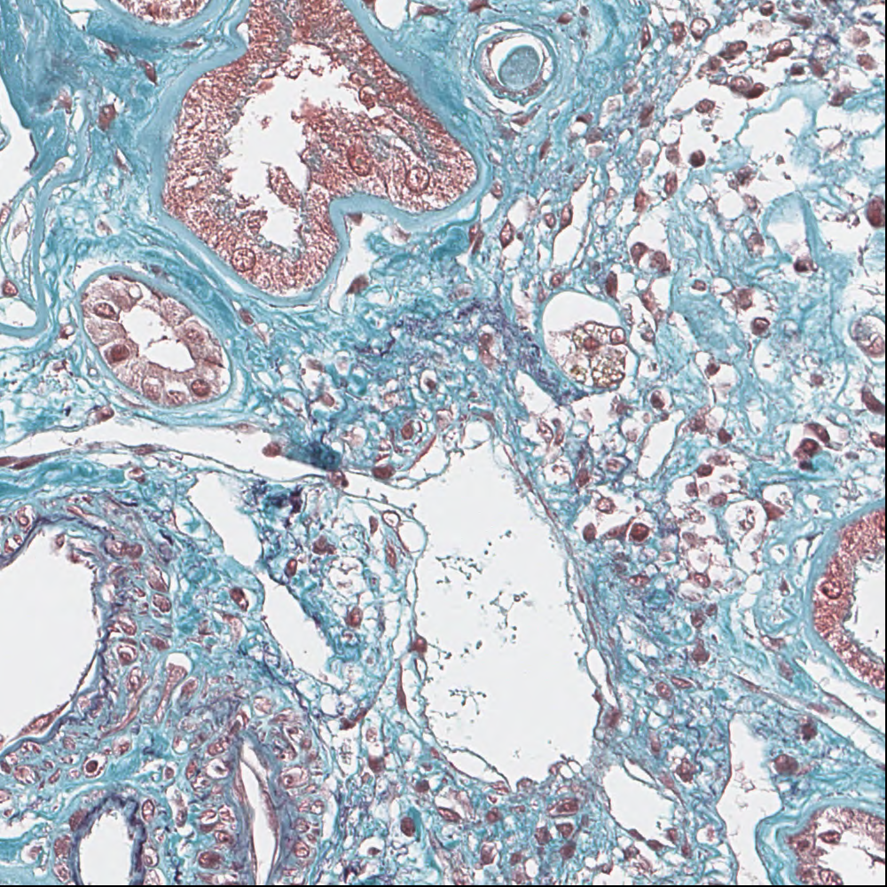
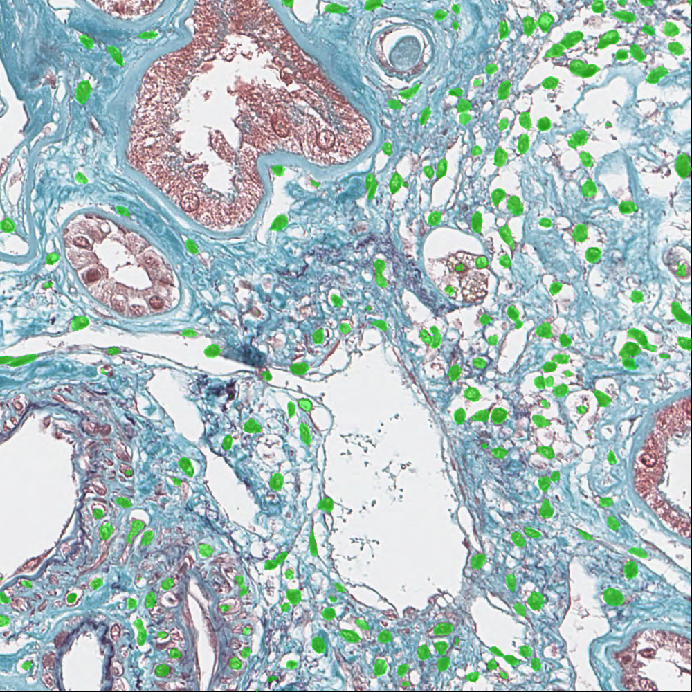
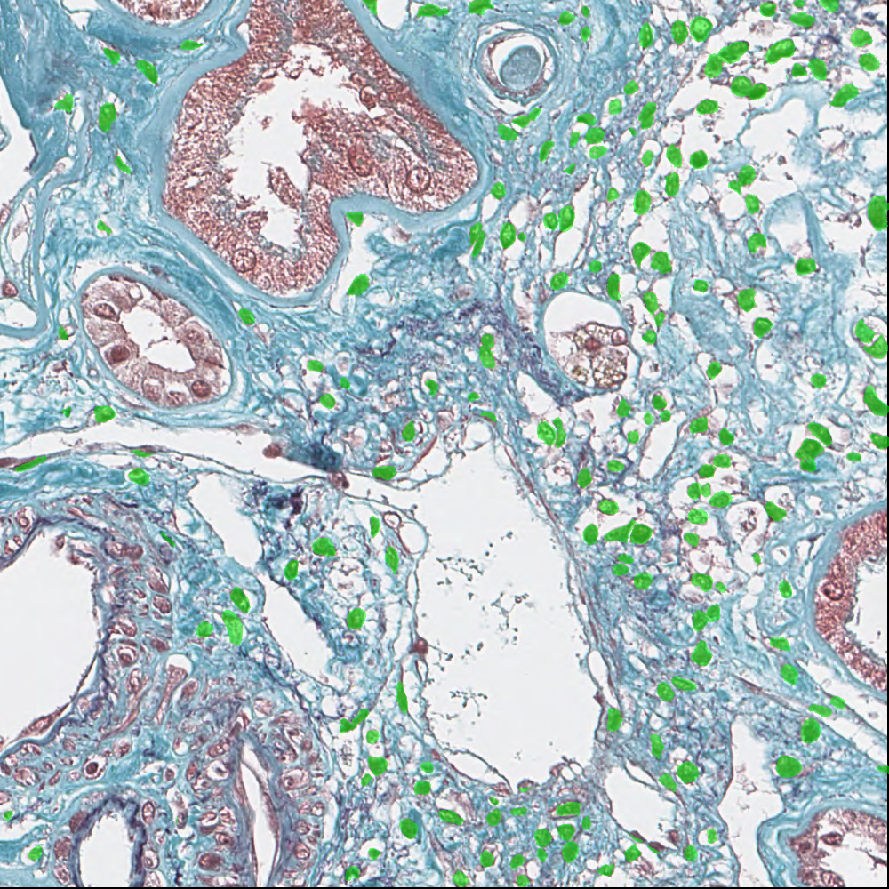

# DLRS
DLRS is a deep learning-based segmentation method for whole slide images (WSIs) of renal biopsy specimens. It is comprised of two deep learning models: DLRS-tissue and DLRS-nucleus. DLRS-tissue is designed to identify non-tissue areas, glomeruli, tubules, interstitia, and arteries in WSIs, while DLRS-nucleus detects nuclei in the interstitium. We recommend further filtering of nuclei that are not within the interstitium using the predicted interstitium from DLRS-tissue.

## Installation
### Requirements: Python 3.8 or higher
```commandline
git clone https://github.com/kanamekojima/DLRS.git
cd DLRS
wget https://media.githubusercontent.com/media/kanamekojima/DLRS/main/checkpoints/DLRS_tissue.pth -O checkpoints/DLRS_tissue.pth
wget https://media.githubusercontent.com/media/kanamekojima/DLRS/main/checkpoints/DLRS_nucleus.pth -O checkpoints/DLRS_nucleus.pth
python3 -m pip install -r requirements.txt
```
Note: OpenCV libraries are required for installation of opencv-python.

DLRS also requires PyTorch. For installation of PyTorch, please visit the [PyTorch installation page](https://pytorch.org/get-started/locally/).

## Example Usage
### Inference
#### Segmentation of Non-Tissue Areas, Glomeruli, Tubules, Interstitia, and Arteries
To predict a segmentation for a slide image, use the pretrained model `DLRS_tissue.pth` with the following command:

```sh
python3 scripts/inference.py \
  --image-file IMAGE_FILE \
  --output-file OUTPUT_IMAGE_FILE \
  --checkpoint checkpoints/DLRS_tissue.pth \
  --segmentation-type tissue \
  --batch-size 100
```
Note: The input slide image should be in a format compatible with OpenCV.

Since training images for the pretrained model `DLRS_tissue.pth` were obtained by scanning renal tissue processed with Masson-Goldner staining at 0.25 &mu;m / pixel resolution, images obtained from the similar condition are recommended for the input slide image. Especially, for images with different resolution, please resize the images to make their resolution align with 0.25 &mu;m / pixel.

Using this command, a slide image with the predicted segmentation for glomeruli, tubules, interstitia, and arteries is generated in `OUTPUT_IMAGE_FILE`.

From the example image located at `example_data/DLRS-tissue/input_slide_image.png`, an image with the predicted segmentation is generated, as shown in the table below.

|  |  |  |
|:---:|:---:|:---:|
| Input slide image | Predicted segmentation | Test segmentation |

#### Detection of Nuclei in Interstitium
To detect nuclei on a slide image, use the pretrained model `DLRS_nucleus.pth` with the following command:
```sh
python3 scripts/inference.py \
  --image-file SLIDE_IMAGE_FILE \
  --output-file OUTPUT_IMAGE_FILE \
  --checkpoint checkpoints/DLRS_nucleus.pth \
  --segmentation-type nucleus \
  --batch-size 100
```
Note: The input slide image should be in a format compatible with OpenCV.

Since training slide images for the pretrained model DLRS_nucleus.pth were obtained in the same manner as the training slide images for DLRS_tissue.pth, using slide images obtained under similar conditions is recommended.

Using this command, a slide image with regions detected as nucleus is generated in `OUTPUT_IMAGE_FILE`.

From the example image located at `example_data/DLRS-nucleus/input_slide_image.png`, an image with detected nuclei is generated, as shown in the table below.

|  |  |  |
|:---:|:---:|:---:|
| Input slide image | Predicted segmentation | Test segmentation |

### Training
To train the deep learning model for DLRS with your own data, first prepare annotated data in the form of one-channel images where each pixel value represents a class label for each slide. This implementation can handle a maximum of 255 class numbers; if you need to work with more than 256 classes, you will need to modify `scripts/train.py`. Next, create files `TRAIN_DATA_LIST_FILE` and `VALIDATION_DATA_LIST_FILE` that list pairs of a slide image file and its corresponding annotation file, with each pair on a separate line, separated by a space. Use these files for training and validation datasets, respectively. To start the training process, run the following command:
```sh
python3 scripts/train.py \
  --train-list TRAIN_DATA_LIST_FILE \
  --validation-list VALIDATION_DATA_LIST_FILE \
  --output-dir results \
  --output-basename train \
  --num-classes 5 \
  --train-batch-size 10 \
  --validation-batch-size 50 \
  --segmentation-type tissue
```

## Options
### Options for `scripts/inference.py`
| Option | Default Value | Summary |
|:-------|:-------------:|:-------|
| --image-file STRING_VALUE | - | Input slide image file |
| --output-file STRING_VALUE | - | Output image file (ensure that the file extension is compatible with OpenCV) |
| --checkpoint STRING_VALUE | - | Checkpoint file |
| --batch-size INT_VALUE | - | Batch size for inference |
| --patch-buffer-size INT_VALUE | 5000 | Buffer size for patch images in memory |
| --patch-stride INT_VALUE | 32 | Step size for extracting patch images from the slide image |
| --segmentation-type STRING_VALUE | - | Segmentation type [tissue / nucleus] |

### Options for `scripts/train.py`
| Option | Default Value | Summary |
|:-------|:-------------:|:-------|
| --train-list STRING_VALUE | - | Text file containing the list of pairs of a slide image file and an annotation file for training |
| --validation-list STRING_VALUE | - | Text file containing the list of pairs of a slide image file and an annotation file for validation |
| --output-dir STRING_VALUE | - | Output dir |
| --output-basename STRING_VALUE | - | Output file basename |
| --num-classes INT_VALUE | - | The number of class labels |
| --train-batch-size INT_VALUE | - | Batch size for training |
| --validation-batch-size INT_VALUE | - | Batch size for validation |
| --patch-size INT_VALUE | 512 | Patch image size |
| --patch-margin INT_VALUE | 38 | Extra buffer space added to patch images prior to random cropping during data augmentation |
| --patch-stride INT_VALUE | 20 | Step size for extracting patch images from slide images |
| --learning-rate FLOAT_VALUE | 1e-5 | Learning rate |
| --iteration-count INT_VALUE | 25000 | Maximum iteration count for learning |
| --segmentation-type STRING_VALUE | - | Segmentation type [tissue / nucleus] |
| --seed INT_VALUE | 3141592653 | Random seed |

## License
Scripts in this repository are licensed under the MIT License - see the [LICENSE](LICENSE) file for details.

## Contact
Developer: Kaname Kojima, Ph.D.

E-mail: kojima [AT] megabank [DOT] tohoku [DOT] ac [DOT] jp
